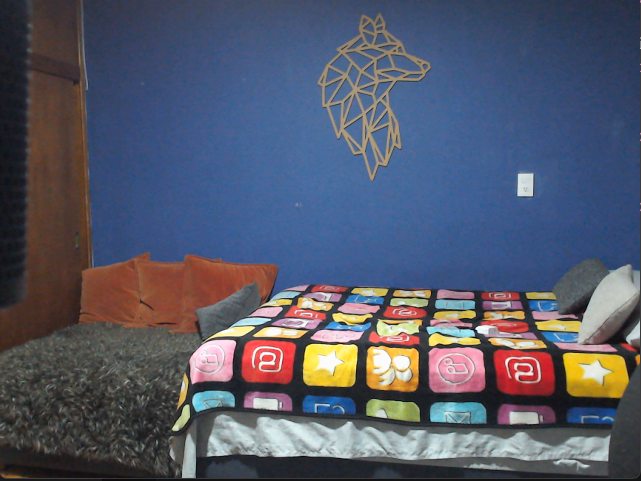
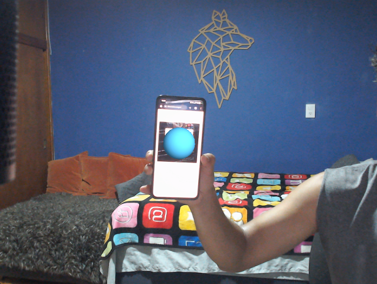
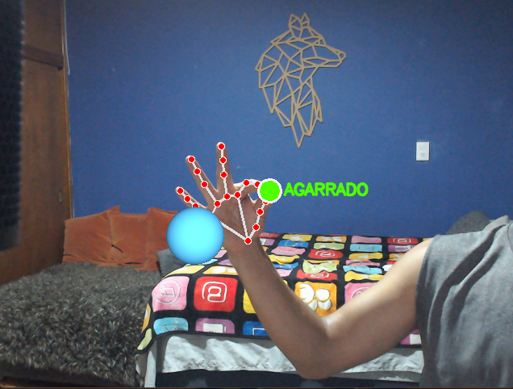
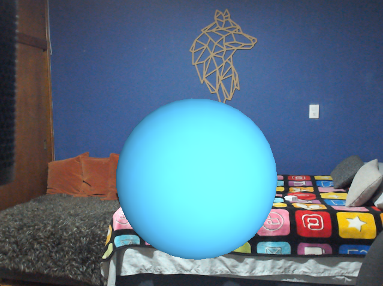

# Práctica: Realidad Aumentada con ArUco + OpenCV + OpenGL + Python

**Nombre:** Salto Salgado Diego  
**Grupo:** B  
**Materia:** Graficación — Enero Junio 2026  

---

## Objetivo de la práctica

Construir una aplicación de Realidad Aumentada en tiempo real que combine tres tecnologías de manera coordinada: captura de video con una webcam convencional como fondo de la escena, detección y estimación de pose de un marcador fiducial ArUco mediante OpenCV (obteniendo `rvec` y `tvec` con `cv2.solvePnP`), y renderizado de un objeto 3D (esfera GLU o tetera GLUT) anclado espacialmente sobre dicho marcador mediante PyOpenGL y GLFW.

El objetivo central es comprender el pipeline completo de AR: desde la captura de imagen hasta la proyección de geometría 3D alineada con el mundo físico, pasando por la construcción de matrices de proyección y de vista a partir de los parámetros intrínsecos reales de la cámara.

---

## Capturas de pantalla

*A continuación se muestran los estados visuales de la aplicación durante la práctica:*

### Escena 1: Solo video — sin marcador visible

### Escena 2: Marcador ArUco detectado — objeto 3D anclado

### Escena 3: Objeto 3D siguiendo el marcador inclinado

### Escena 4: Escala modificada (teclas + / -)

---

## Tabla comparativa de resultados

| Componente | Implementación en el código | Resultado observado |
| :--- | :--- | :--- |
| **Captura de video y fondo** | `cv2.VideoCapture(CAMERA_INDEX)` captura frames BGR cada iteración. `upload_frame_texture` convierte BGR→RGB, voltea verticalmente y sube a la GPU. `draw_background_quad` dibuja un quad ortográfico a pantalla completa con la textura del frame. | El video de la webcam aparece como fondo en tiempo real, sin parpadeo ni desfase perceptible. |
| **Generación del marcador ArUco** | `cv2.aruco.getPredefinedDictionary(DICT_4X4_50)` + `generateImageMarker(id=0, 400px)` genera el PNG. Se imprime y se mide físicamente; el resultado se asigna a `MARKER_LENGTH_M = 0.10`. | Marcador ID 0 impreso de 10 cm de lado, reconocido de forma estable a distancias de 15–80 cm. |
| **Detección del marcador** | `detect_marker` llama a `ArucoDetector.detectMarkers` sobre el frame en escala de grises. Filtra por `MARKER_ID = 0` y devuelve las 4 esquinas `(1, 4, 2)`. | El marcador se detecta correctamente bajo iluminación normal. Las esquinas se actualizan cada frame siguiendo la posición real del papel. |
| **Estimación de pose 3D** | `estimate_pose` llama a `cv2.solvePnP` con `SOLVEPNP_IPPE_SQUARE`, comparando las 4 esquinas 3D reales del marcador (plano Z=0, ±`MARKER_LENGTH_M/2`) contra sus proyecciones 2D detectadas. Devuelve `rvec` (Rodrigues) y `tvec` (traslación en metros). | La posición y orientación del marcador en 3D se recuperan con precisión suficiente para que el objeto 3D parezca "pegado" al papel al moverlo o inclinarlo. |
| **Construcción de matrices OpenGL** | `projection_from_k` traduce la matriz intrínseca `K` a una matriz de proyección 4×4 compatible con OpenGL. `modelview_from_pose` convierte `rvec`+`tvec` a `ModelView` aplicando `diag(1,−1,−1,1)` para corregir la diferencia de convenio de ejes entre OpenCV (Y↓) y OpenGL (Y↑). | El objeto 3D se alinea correctamente con el marcador: sin corrección de ejes aparecería espejado o hundido bajo el papel. |
| **Renderizado del objeto 3D** | `draw_ar_object` aplica `glTranslatef(0, 0, scale*0.5)` para elevar el objeto sobre el plano del marcador, luego llama a `gluSphere` (modo `"sphere"`) o `glutSolidTeapot` (modo `"teapot"`). Iluminación Phong con `GL_LIGHT0`. | La esfera azul o la tetera naranja aparecen encima del marcador con sombreado correcto, siguiendo todos sus movimientos y rotaciones en tiempo real. |
| **Controles interactivos** | Callback `on_key` registrado con `glfw.set_key_callback`: `T` alterna objeto, `+/-` ajustan `MODEL_SCALE` en pasos de 10 %, `ESC/Q` cierran la ventana. | Los cambios se aplican en el siguiente frame sin interrumpir el flujo. La escala responde de forma fluida. |

---

## Respuestas a las preguntas de análisis

**¿Qué papel juega `MARKER_LENGTH_M` en la precisión de la RA y qué ocurre si su valor no coincide con la medida real del marcador impreso?**

`MARKER_LENGTH_M` es el único vínculo entre las unidades del programa (metros) y las unidades del mundo físico. `solvePnP` construye los puntos 3D de referencia del marcador como `±MARKER_LENGTH_M/2` en X e Y; si ese valor difiere de la medida real, la relación entre el tamaño aparente del marcador en la imagen y su profundidad estimada será incorrecta. El resultado concreto es que `tvec` tendrá una escala errónea en Z: si el marcador real mide 10 cm pero se declaran 20 cm, el objeto parecerá estar el doble de lejos de lo que está, y su tamaño proyectado en pantalla no coincidirá con el del papel. La orientación (`rvec`) no se ve afectada, pero la traslación sí, lo que hace que el objeto parezca "flotar" a distinta altura o cambiar de tamaño al acercar o alejar el marcador.

---

**¿Por qué es necesaria la corrección `diag(1, −1, −1, 1)` en `modelview_from_pose` y qué artefacto visual aparecería sin ella?**

OpenCV y OpenGL definen sus sistemas de coordenadas de cámara de forma distinta. En OpenCV el eje Y apunta hacia abajo (dirección natural de las filas de la imagen) y el eje Z apunta hacia el interior de la escena (hacia donde "mira" la cámara). En OpenGL, por convención histórica, Y apunta hacia arriba y Z apunta hacia el observador (saliendo de la pantalla). La matriz `diag(1, −1, −1, 1)` invierte los ejes Y y Z de la transformación antes de pasarla a OpenGL, reconciliando ambos convenios. Sin esta corrección, el objeto aparecería espejado verticalmente (Y invertido) y proyectado "hacia atrás" (Z invertido), es decir, quedaría enterrado bajo el plano del marcador o no sería visible en absoluto desde la cámara virtual.

---

**¿Por qué `draw_background_quad` desactiva `GL_DEPTH_TEST` y `GL_LIGHTING` antes de dibujar el fondo y los reactiva después?**

El quad de fondo es una imagen 2D que debe cubrir toda la ventana sin interactuar con la escena 3D. Si el test de profundidad estuviera activo, OpenGL podría descartar fragmentos del quad (o del objeto 3D posterior) en función del valor Z, produciendo que el video tapara la esfera o viceversa de forma incorrecta. Al desactivar `GL_DEPTH_TEST`, el quad siempre se dibuja completo. Inmediatamente después, al limpiar el buffer de profundidad con `glClear(GL_DEPTH_BUFFER_BIT)` (hecho antes en el bucle), y reactivar `GL_DEPTH_TEST`, el objeto 3D puede usar el buffer limpio para sus propias comparaciones de profundidad correctamente. La iluminación se desactiva porque el quad es una textura plana que no debe verse afectada por las luces de la escena: si estuviera activa, el video se oscurecería según el ángulo de `GL_LIGHT0`.

---

**¿Qué diferencia hay entre usar una `K` por defecto (`default_camera_matrix`) y una `K` calibrada (`camera_ar.npz`), y en qué parte de la escena se nota más la diferencia?**

La matriz `K` por defecto asume que la focal es igual al mayor lado de la imagen en píxeles y que el centro óptico está exactamente en el centro geométrico del frame. Una `K` real, obtenida con un proceso de calibración (tablero de ajedrez, múltiples vistas), incluye también los coeficientes de distorsión de la lente. La diferencia se nota especialmente en los bordes de la imagen: con `K` por defecto, el marcador detectado cerca del borde puede tener un `tvec` ligeramente erróneo porque la distorsión radial de la lente no está compensada, haciendo que el objeto 3D se desplace o incline de forma espuria. En el centro de la imagen la diferencia es mínima porque las lentes modernas presentan poca distorsión en esa zona.

---

## Conclusión final

Esta práctica demostró que la Realidad Aumentada, lejos de ser un dominio exclusivo de motores comerciales, puede construirse desde sus fundamentos matemáticos con herramientas de código abierto. El pipeline implementado —captura → detección ArUco → `solvePnP` → construcción de matrices OpenGL → renderizado— es exactamente el mismo que subyace a sistemas AR de producción, pero aquí cada paso es visible, modificable y comprensible.

El punto matemáticamente más rico de la práctica fue la cadena de transformaciones que convierte las esquinas 2D detectadas en una pose 3D y luego esa pose en matrices compatibles con el pipeline de rasterización de OpenGL. Comprender por qué es necesario invertir los ejes Y y Z, por qué la matriz de proyección se construye directamente desde los parámetros intrínsecos de la cámara, y por qué el valor de `MARKER_LENGTH_M` es crítico para la escala, consolida de forma práctica conceptos de geometría proyectiva, álgebra lineal y visión por computadora que de otro modo quedarían abstractos.

El resultado final —un objeto 3D que parece "pegado" a un trozo de papel y que sigue sus movimientos y rotaciones en tiempo real sin motor gráfico ni hardware especializado— es una demostración concreta de que el dominio de las matemáticas subyacentes es suficiente para construir experiencias interactivas convincentes.